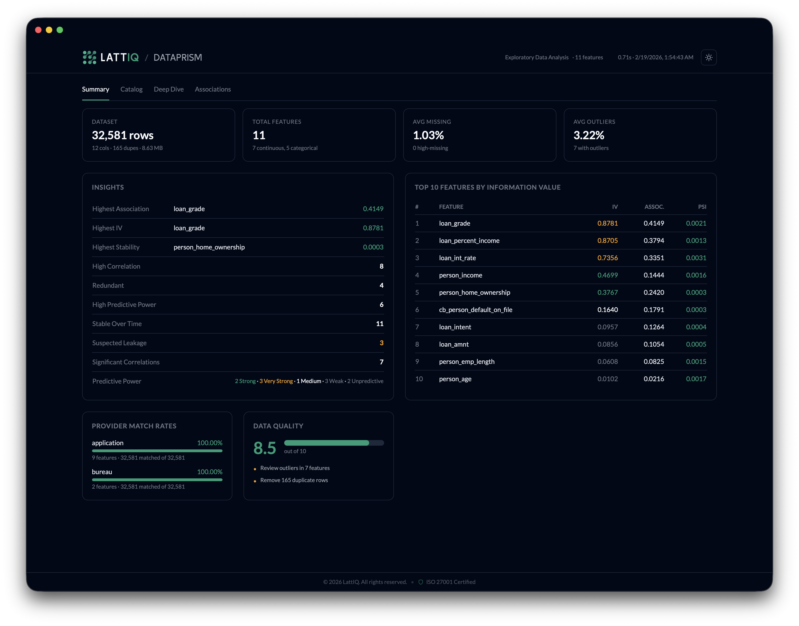
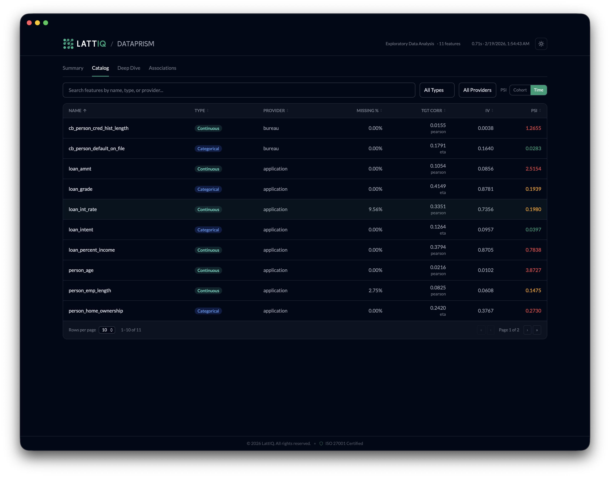
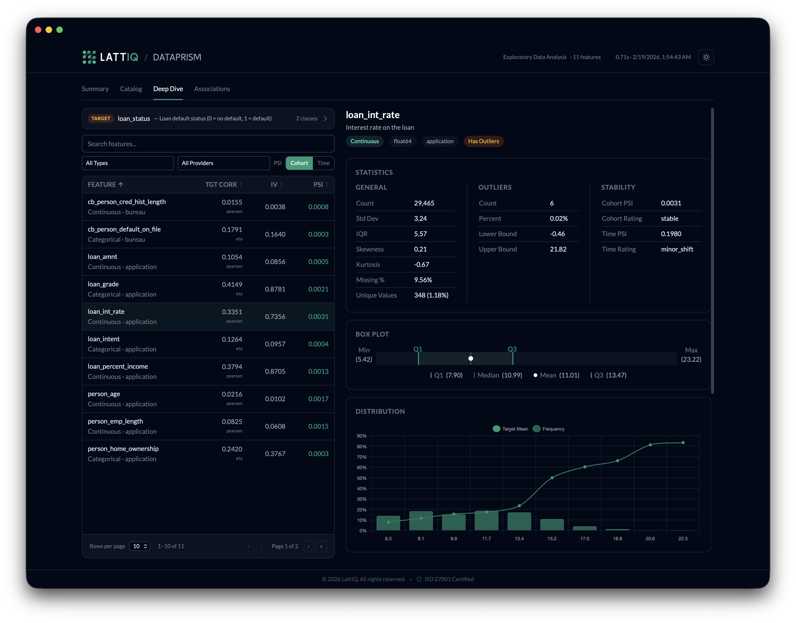
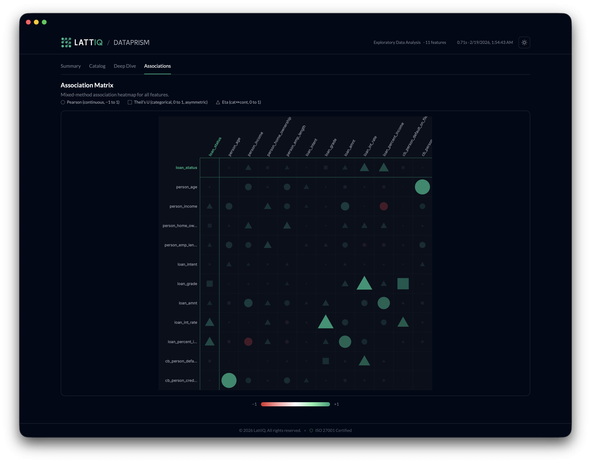

# DataPrism

A comprehensive Python library for exploratory data analysis with advanced features for data profiling, quality assessment, and stability monitoring.

[](https://www.python.org/downloads/)
[](https://opensource.org/licenses/MIT)

## Interactive Viewer

DataPrism includes a built-in interactive dashboard to explore your analysis results in the browser.

```python
from dataprism import DataPrism, DataLoader

# Load data from CSV or Parquet
df = DataLoader.load_csv("data.csv")
# df = DataLoader.load_parquet("data.parquet")

# Run analysis and launch viewer
prism = DataPrism()
prism.analyze(
    data=df,
    target_variable="target",
    exclude_columns=["id", "split", "onboarding_date"],
    output_path="eda_results.json",
)
prism.view()
```

**Summary** — Dataset overview, insights, top features by IV, data quality score, and provider match rates.



**Catalog** — Sortable feature table with type, provider, target correlation, IV, and PSI at a glance.



**Deep Dive** — Per-feature detail view with statistics, violin plots, distribution charts, PSI trend analysis, target associations, and correlations.



**Associations** — Mixed-method heatmap (Pearson, Theil's U, Eta) showing relationships across all features.



## How DataPrism Compares

| Feature                      |             DataPrism             |     Sweetviz     |          ydata-profiling          | AutoViz |    D-Tale    |          DataPrep          |
| ---------------------------- | :-------------------------------: | :--------------: | :-------------------------------: | :-----: | :----------: | :------------------------: |
| Programmatic API             |                Yes                |       Yes        |                Yes                |   Yes   |     Yes      |            Yes             |
| Interactive Viewer           |                Yes                |       Yes        |                Yes                | Partial |     Yes      |            Yes             |
| Correlation Analysis         | Pearson, Spearman, Theil's U, Eta | Pearson, UC, Eta | Pearson, Spearman, Kendall, Phi-k | Pearson | Pearson, PPS | Pearson, Spearman, Kendall |
| Histogram / Bar Chart        |                Yes                |       Yes        |                Yes                |   Yes   |     Yes      |            Yes             |
| Box Plot                     |                Yes                |        —         |                Yes                |    —    |     Yes      |            Yes             |
| Association Heatmap          |                Yes                |       Yes        |                Yes                |    —    |     Yes      |            Yes             |
| Target-Overlaid Distribution |                Yes                |       Yes        |                 —                 |    —    |      —       |             —              |
| Scatter / Pair Plot          |                 —                 |        —         |                Yes                |   Yes   |     Yes      |            Yes             |
| Violin Plot                  |                Yes                |        —         |                 —                 |   Yes   |      —       |             —              |
| Time Series / Trend          |                Yes                |        —         |                Yes                |    —    |     Yes      |             —              |
| Schema-Driven Analysis       |                Yes                |     Partial      |                Yes                |    —    |   Partial    |          Partial           |
| Mixed-Type Associations      |                Yes                |       Yes        |                Yes                |    —    |   Partial    |          Partial           |
| Structured JSON Export       |                Yes                |        —         |                Yes                |    —    |   Partial    |             —              |
| **Target Analysis (IV/WoE)** |              **Yes**              |        —         |                 —                 |    —    |      —       |             —              |
| **Drift / PSI Stability**    |              **Yes**              |        —         |                 —                 |    —    |      —       |             —              |
| **Data Quality Score**       |              **Yes**              |        —         |                 —                 |    —    |      —       |             —              |
| **Sentinel Value Handling**  |              **Yes**              |        —         |                 —                 |    —    |      —       |             —              |
| **Provider Match Rates**     |              **Yes**              |        —         |                 —                 |    —    |      —       |             —              |

**Where DataPrism leads:** Schema-aware profiling with column roles and sentinel codes, IV/WoE for credit risk, PSI-based stability monitoring (cohort + time-based), automated data quality scoring, and provider-level match rates. No other EDA library covers these out of the box.

**Where DataPrism lags:** No dataset comparison (train vs test side-by-side), no auto-visualization per feature, and no Spark/Dask support for distributed datasets. These are on the roadmap.

## Roadmap

DataPrism is being built for the AI era — where data analysis is increasingly driven by LLM agents, automated pipelines, and programmatic consumers rather than humans clicking through dashboards.

### AI-Native Analysis

- **LLM-consumable output** — Structured JSON output designed for AI agents to read, reason about, and act on. No screen-scraping HTML reports or parsing PDFs.
- **Natural language insights** — Auto-generated plain-English summaries of each feature, anomalies, and recommendations that LLMs can directly incorporate into reports.
- **Agent-friendly API** — Minimal, predictable interface (`analyze()` → `view()`) that AI coding assistants can invoke without ambiguity. Schema-driven configuration over magic defaults.

### Closing the Gaps

- **Dataset comparison** — Side-by-side train/test/production profiling with automatic drift highlights.
- **Scatter & pair plots** — Interactive scatter matrices for continuous feature pairs with target coloring.
- **Auto-visualization** — One-line generation of per-feature visual summaries exportable as images.
- **Spark/Dask support** — Distributed computation for datasets that don't fit in memory.
- **Streaming analysis** — Incremental profiling for real-time data pipelines without re-analyzing the full dataset.

### Deeper Intelligence

- **Automated feature recommendations** — Go beyond flagging issues to suggesting transformations (log, binning, encoding) based on distribution shape and target relationship.
- **Anomaly explanations** — When outliers or drift are detected, surface the likely cause (data pipeline issues, population shift, seasonality).
- **Cross-dataset lineage** — Track how feature distributions evolve across model versions and data refreshes.

## Features

- **Automated Feature Analysis** — Continuous and categorical profiling with automatic type inference and missing value detection
- **Target Relationship Analysis** — Information Value (IV), Weight of Evidence (WoE), optimal binning, predictive power classification
- **Correlation & Association Analysis** — Pearson, Spearman, Theil's U, Eta with unified association matrix across all feature types
- **Quality Assessment** — Automated scoring (0-10), per-feature quality flags, actionable recommendations
- **Sentinel Value Handling** — Automatic detection and replacement of no-hit values with nullable type preservation
- **Cohort-Based Stability** — PSI and KS test for train/test drift detection
- **Time-Based Stability** — Monthly, weekly, quartile, or custom time windows with temporal trend analysis
- **Provider Match Rates** — Automatic data coverage statistics by provider
- **Large Dataset Support** — CSV and Parquet formats, chunked reading, configurable sampling

## Installation

```bash
pip install dataprism
```

## Quick Start

### Basic Usage

```python
from dataprism import DataPrism, DataLoader
import pandas as pd

# Option 1: Load from file using DataLoader
df = DataLoader.load_csv("data.csv")

# Option 2: Use existing DataFrame
df = pd.read_csv("data.csv")  # or from database, etc.

# Initialize prism
prism = DataPrism(
    max_categories=50,
    top_correlations=10
)

# Run analysis (exclude non-feature columns when no schema is available)
results = prism.analyze(
    data=df,
    exclude_columns=["customer_id", "created_at"],
    target_variable="target",
    output_path="eda_results.json"
)
```

### With DatasetSchema

```python
from dataprism import (
    DataPrism, DataLoader,
    ColumnConfig, ColumnType, ColumnRole, Sentinels, DatasetSchema,
)

# Load data and schema
df = DataLoader.load_csv("data.csv")
schema = DataLoader.load_schema("schema.json")

# Or create schema programmatically
schema = DatasetSchema([
    ColumnConfig('age', ColumnType.CONTINUOUS, ColumnRole.FEATURE,
                 provider='demographics', description='User age',
                 sentinels=Sentinels(not_found='-1')),
    ColumnConfig('zip_code', ColumnType.CATEGORICAL, ColumnRole.FEATURE,
                 provider='address', description='ZIP code',
                 sentinels=Sentinels(not_found='', missing='00000')),
    ColumnConfig('target', ColumnType.BINARY, ColumnRole.TARGET),
])

# Run with schema
prism = DataPrism()
results = prism.analyze(
    data=df,
    schema=schema,
    target_variable="target",
    output_path="eda_results.json"
)
```

**Schema JSON format** (`schema.json`):

```json
{
  "columns": [
    {
      "name": "age",
      "type": "continuous",
      "role": "feature",
      "provider": "demographics",
      "description": "User age",
      "sentinels": {
        "not_found": "-1",
        "missing": null
      }
    }
  ]
}
```

### Stability Analysis

#### Cohort-Based (Train/Test)

```python
from dataprism import DataPrism, DataLoader

# Load data and schema
df = DataLoader.load_parquet("data.parquet")
schema = DataLoader.load_schema("schema.json")

# Configure for stability analysis
prism = DataPrism(
    calculate_stability=True,
    cohort_column='dataTag',
    baseline_cohort='training',
    comparison_cohort='test'
)

results = prism.analyze(
    data=df,
    schema=schema
)
```

#### Time-Based

```python
from dataprism import DataPrism, DataLoader

# Load data and schema
df = DataLoader.load_parquet("data.parquet")
schema = DataLoader.load_schema("schema.json")

# Configure for time-based stability
prism = DataPrism(
    time_based_stability=True,
    time_column='onboarding_time',
    time_window_strategy='monthly',  # or 'weekly', 'quartiles', 'custom'
    baseline_period='first',
    comparison_periods='all',
    min_samples_per_period=100
)

results = prism.analyze(
    data=df,
    schema=schema
)
```

## Development

```bash
pip install -e .           # Install for development
python -m build            # Build package
python -m pytest tests/    # Run tests
```

## Documentation

- [Architecture](docs/ARCHITECTURE.md) — internals, module structure, data flow
- [Usage Guide](docs/USAGE.md) — advanced configuration, provider match rates, feature counts reference
- [Decision Records](docs/decisions/) — key design decisions and rationale
- [Examples](examples/) — usage examples and demos

## Requirements

- Python 3.9+
- pandas >= 2.0.0
- numpy >= 1.24.0
- scipy >= 1.10.0
- pyarrow >= 10.0.0 (for Parquet support)

## License

MIT License - see [LICENSE](LICENSE) file for details.

## Contact

For questions or suggestions:

- Email: dev@lattiq.com
- GitHub: [https://github.com/lattiq/dataprism](https://github.com/lattiq/dataprism)

## Contributing

Contributions are welcome! Please feel free to submit a Pull Request.
